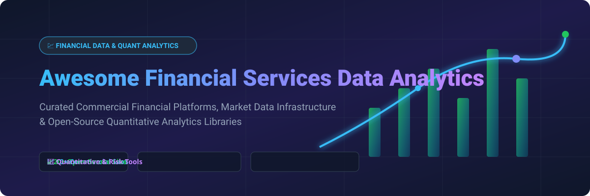

# Awesome-Financial-Services-Data-Analytics 💹 📊 🚀

  

  
  
  
  
  
  

---

## 🌟 Top Financial Services Data Analytics Ecosystem 📈 💡

**Curated List of Commercial Financial Data Platforms & Open-Source Quantitative Analytics Tools**  

*Focused on Market Data Analytics, Quantitative Portfolio Risk, Algorithmic Trade Analytics, Financial Modeling, Alternative Data & Self-Hosted Financial Data Infrastructure* 🏦 ⚡

**Last updated: October 2026** 📅

---

### 📌 Overview & SEO Summary 🔍 📊

Welcome to the ultimate curated directory of **financial services data analytics platforms**, **open-source quantitative finance libraries**, and **market data pipelines**. Whether you are looking for enterprise-grade commercial solutions (such as *Bloomberg Enterprise Data*, *FactSet*, and *S&P Capital IQ*), or self-hostable open-source alternatives (like *OpenBB*, *QuantLib*, and *ccxt*), this list covers category leaders, quantitative analytics, and privacy-respecting financial data infrastructure.

**Key Market Context:** 💡
- **OpenBB** is the **leading open-source investment research platform**, with **30K+ GitHub_Stars** and **Bloomberg Terminal-class functionality** at zero cost.
- **QuantLib** is the **most comprehensive open-source quantitative finance library**, with **5K+ GitHub_Stars** and **derivatives pricing, risk management, and fixed income analytics**.
- **ccxt** is the **leading crypto trading & market data integration framework** supporting 100+ exchanges with **33K+ GitHub_Stars**.

---

## 📑 Table of Contents 🗂️

- [🏢 SaaS & Commercial Platforms](#-saas--commercial-platforms)
- [🔓 Open-Source GitHub Projects](#-open-source-github-projects)
- [🛠️ How to Contribute](#%EF%B8%8F-how-to-contribute)
- [📊 Star History](#-star-history)
- [🤝 Support & Sponsorship](#-support--sponsorship)
- [⚠️ Disclaimer](#%EF%B8%8F-disclaimer)

---

## 🏢 SaaS / Commercial Platforms 🏢 💵

**Market Size & Sector Concentration:**  
The global financial data and analytics market size is estimated at **~$45 Billion USD** in 2026 and is projected to reach **~$68 Billion USD** by 2030 (growing at a CAGR of ~8.5%). The sector is **moderately concentrated** with oligopolistic market dynamics in core data terminals (dominated by Bloomberg and LSEG Refinitiv), while remaining **highly fragmented** in specialized alternative data pipelines, cloud analytics infrastructure, and niche AI quantitative platforms.

| SaaS / Commercial Platform | Company / Owner | Valuation / Market Cap | Standard Edition Starting Price | Free Tier / Free Trial Limits | Description |
| :--- | :--- | :--- | :--- | :--- | :--- |
| **[Amazon FinSpace](https://aws.amazon.com/finspace/)** ☁️ | Amazon | ~$2.0 Trillion | **$0.60/hour** (environment) + compute costs | **AWS Free Tier: 2 months free environment access + AWS Free Tier compute limits** | **AWS-native financial data analytics** — **Purpose-built for financial services data** . **Managed infrastructure for quantitative research** . **Petabyte-scale analytics with time-series data** . **Integrates with S3, Glue, and SageMaker** . ☁️ |
| **[Bloomberg Enterprise Data](https://www.bloomberg.com/professional/product/data-license/)** 📈 | Bloomberg | ~$60 Billion | **~$30,000/year** per Terminal user | **No free tier; 30-day corporate trial available on request** | **The gold standard for financial data** — **Real-time market data, reference data, and historical data** . **Terminal integration with analytics and news** . **API access for quantitative analysis** . **The most comprehensive financial data platform** . 📈 |
| **[Snowflake Financial Services Cloud](https://www.snowflake.com/)** ❄️ | Snowflake | ~$50 Billion | **$2.00/credit** (Standard Edition on AWS) + storage | **30-day free trial with $400 in free credits** | **Cloud data platform for financial services** — **Data cloud for market data, risk, and compliance** . **Snowpark for Python and Java analytics** . **Financial Services Data Cloud with partner ecosystem** . ❄️ |
| **[Refinitiv Data Platform](https://www.refinitiv.com/)** 🔴 | LSEG (London Stock Exchange Group) | ~$50 Billion | **~$15,000/year** per user seat | **No free tier; 14-day institutional trial on request** | **Financial data and analytics** — **Market data, reference data, and news** . **The most comprehensive financial data platform after Bloomberg** . 🔴 |
| **[Databricks for Financial Services](https://www.databricks.com/)** 🧱 | Databricks | ~$43 Billion | **$0.15–$0.40/DBU** (Standard Edition compute) | **14-day free trial on AWS/Azure/GCP** | **Lakehouse platform for financial services** — **Unified data analytics and AI** . **Delta Lake for reliable data pipelines** . **MLflow for model management** . 🧱 |
| **[S&P Capital IQ Pro](https://www.spglobal.com/marketintelligence/)** 📊 | S&P Global | ~$40 Billion | **~$13,000/year** per user | **No free tier; 7-day corporate trial upon approval** | **Financial data and analytics platform** — **Company data, market data, and research** . **The most comprehensive financial data platform for investment research** . 📊 |
| **[FactSet Data Management](https://www.factset.com/)** 🔵 | FactSet | ~$15 Billion | **~$12,000/year** per user | **No free tier; 14-day sales demo trial** | **Financial data and analytics platform** — **Market data, fundamentals, and estimates** . **Portfolio analytics and risk management** . **The most comprehensive financial data platform after Bloomberg** . 🔵 |
| **[Morningstar Data](https://www.morningstar.com/)** 🌅 | Morningstar | ~$15 Billion | **~$10,000/year** per user (Morningstar Direct) | **No free tier; 14-day free trial for Morningstar Investor / Direct demo on request** | **Investment research data** — **Mutual fund and ETF data, ratings, and analytics** . **The most trusted investment research data provider** . 🌅 |
| **[Envestnet Yodlee](https://www.yodlee.com/)** 🏦 | Envestnet | ~$3 Billion | **~$1,000/month** base platform fee | **Free developer sandbox with synthetic test data** | **Financial data aggregation** — **Bank, credit card, and investment account data** . **The most comprehensive financial data aggregation platform** . 🏦 |
| **[GoldenSource](https://www.goldensource.com/)** 🏛️ | GoldenSource | Private (~$500 Million) | **~$50,000/year** estimated base platform | **No free tier; interactive live demo upon request** | **Enterprise data management** — **Reference data, market data, and security master** . **The most comprehensive financial data management platform** . 🏛️ |

---

## 🔓 Open-Source GitHub Projects 🔓 🛠️

*Sorted by GitHub_Stars_Count (Descending)* 🌟

- **[ccxt](https://github.com/ccxt/ccxt)**   
  **Crypto currency market data & trading library**, MIT licensed. **33K+ GitHub_Stars** — **connects to 100+ crypto exchanges** . **JavaScript, Python, and PHP support for market data stream & algorithmic trading** . 🪙

- **[OpenBB](https://github.com/OpenBB-finance/OpenBB)**   
  **Open-source investment research platform**, AGPL-3.0 licensed. **30K+ GitHub_Stars** — **the Bloomberg Terminal alternative** for retail investors and analysts . **Stocks, options, crypto, forex, and macro data** . **AI-powered analysis with OpenBB Copilot** . **The most comprehensive open-source financial data platform** . 📊

- **[yfinance](https://github.com/ranaroussi/yfinance)**   
  **Yahoo Finance market data downloader**, Apache-2.0 licensed. **16K+ GitHub_Stars** — **the standard for downloading market data in Python** . **Stocks, ETFs, mutual funds, and crypto** . **The most accessible open-source market data library** . 📥

- **[Backtrader](https://github.com/mementum/backtrader)**   
  **Python backtesting and trading framework**, GPL-3.0 licensed. **15K+ GitHub_Stars** — **supports stocks, futures, forex, and crypto** . **Live trading integration with Interactive Brokers, Oanda, and more** . **The most feature-complete open-source backtesting framework** . ⚡

- **[Freqtrade](https://github.com/freqtrade/freqtrade)**   
  **Free and open-source crypto trading bot**, GPL-3.0 licensed. **15K+ GitHub_Stars** — **backtesting, strategy optimization, and live algorithmic trading** . **Telegram bot control and custom strategy plotting** . 🤖

- **[TA-Lib](https://github.com/TA-Lib/ta-lib)**   
  **Technical analysis library**, BSD-3-Clause licensed. **10K+ GitHub_Stars** — **the original technical analysis library** with **200+ indicators for C, C++, Python, and Java** . **The standard for algorithmic trading indicators** . 🏛️

- **[Lean](https://github.com/QuantConnect/Lean)**   
  **QuantConnect Lean Algorithmic Trading Engine**, Apache-2.0 licensed. **8K+ GitHub_Stars** — **C# & Python event-driven algorithmic backtesting and live execution engine** for equity, FX, futures, options, and crypto . ⚙️

- **[pandas-ta](https://github.com/twopirllc/pandas-ta)**   
  **Technical analysis library for Python**, MIT licensed. **5K+ GitHub_Stars** — **130+ indicators and 60+ candlestick patterns** . **Pandas-based for efficient computation** . **The most complete open-source technical analysis library** . 📉

- **[QuantLib](https://github.com/lballabio/QuantLib)**   
  **The most comprehensive open-source quantitative finance library**, modified BSD license. **5K+ GitHub_Stars** — **derivatives pricing, risk management, and fixed income analytics** . **C++ core with Python, R, Java, and C# bindings** . **The standard for quantitative finance** . 🧮

- **[PyPortfolioOpt](https://github.com/robertmartin8/PyPortfolioOpt)**   
  **Financial portfolio optimization in Python**, MIT licensed. **4K+ GitHub_Stars** — **mean-variance optimization, Black-Litterman, and hierarchical risk parity** . **The most comprehensive open-source portfolio optimization library** . 🎯

- **[Pyfolio](https://github.com/quantopian/pyfolio)**   
  **Portfolio and risk analytics**, Apache-2.0 licensed. **4K+ GitHub_Stars** — **the standard for portfolio performance analysis** . **Returns, drawdowns, and risk metrics** . **The foundation for portfolio analytics** . 📈

- **[Alphalens](https://github.com/quantopian/alphalens)**   
  **Performance analysis of predictive stock factors**, Apache-2.0 licensed. **3K+ GitHub_Stars** — **the standard for factor analysis** . **Used by quant researchers for alpha factor validation** . 🔬

- **[Zipline](https://github.com/stefan-jansen/zipline-reloaded)**   
  **Pythonic algorithmic trading library**, Apache-2.0 licensed. **3K+ GitHub_Stars** — **the most widely used open-source backtester** — originally developed by Quantopian, now maintained by **QuantRocket** . **Event-driven backtesting with realistic transaction costs** . **The standard for algorithmic trading research** . 📈

- **[Riskfolio-Lib](https://github.com/dcajasn/Riskfolio-Lib)**   
  **Portfolio optimization and quantitative strategic asset allocation**, BSD-3-Clause licensed. **2K+ GitHub_Stars** — **60+ risk measures and 20+ portfolio optimization models** . **The most advanced open-source portfolio optimization library** . 📊

- **[finnhub-python](https://github.com/Finnhub-Stock-API/finnhub-python)**   
  **Finnhub API client**, Apache-2.0 licensed. **Real-time market data, fundamentals, and alternative data** . **Free tier with 60 API calls/minute** . **The most accessible commercial financial data API** . 🔌

- **[Financial Modeling Prep](https://github.com/Financial-Modeling-Prep/financial-modeling-prep)**   
  **Financial data API**, open-source. **Financial statements, ratios, and market data** . **Free tier available** . **The most accessible fundamental data API** . 📋

- **[Alpha Vantage](https://github.com/AlphaVantage/alphavantage-api)**   
  **Financial market data API**, open-source. **Stocks, forex, and crypto data** . **Free tier with 5 API calls/minute** . **The most widely used free financial data API** . 🌐

---

## 🛠️ How to Contribute 🛠️ 📝

Contributions are welcome! Follow these steps to submit new financial data analytics platforms or open-source financial software:

1. 🍴 **Fork** the repository.
2. 📝 **Add/edit** entries in `README.md` maintaining table/list structure and formatting.
3. 🔗 Include project title, official website/GitHub link, exact Stars_Count, license, and brief description.
4. 🚀 Submit a **Pull Request** with a descriptive summary of your changes.

---

## 📊 Star History

---

## 🤝 Support & Sponsorship 🤝 ☕

If you find this financial services data analytics repository useful, please consider supporting the project:

- ⭐ **Star** this repository to increase visibility!
- 🔀 **Fork** and share with fellow quantitative analysts, fintech engineers, and open-source advocates.
- ☕ **Sponsor & Buy Me a Coffee**: Support ongoing open-source curation via the [GitHub Sponsor Dashboard](https://github.com/sponsors/ishandutta2007).

Thank you for supporting open-source financial data & quantitative analytics software! ❤️

---

## ⚠️ Disclaimer ⚠️ ℹ️

- This is a **community-curated** list — not exhaustive and not an endorsement. ℹ️
- **Bloomberg Terminal costs ~$30,000/year per user** — **FactSet starts at ~$12,000/year** — **S&P Capital IQ Pro starts at ~$13,000/year** . **OpenBB provides Bloomberg Terminal-class functionality at zero cost** with **30K+ GitHub_Stars** .
- **QuantLib is the most comprehensive open-source quantitative finance library** — **derivatives pricing, risk management, and fixed income analytics** . **Zipline is the most widely used open-source backtester** .
- **Open-source financial analytics tools are not turnkey** — they require **data source configuration, model validation, and ongoing maintenance** . **yfinance relies on Yahoo Finance data** which may have gaps . **Always validate model accuracy and backtest results with a proof-of-concept** before production deployment . 💹

---

  <b>Made with ❤️ for quantitative analysts, fintech engineers, and open-source financial data advocates.</b>

